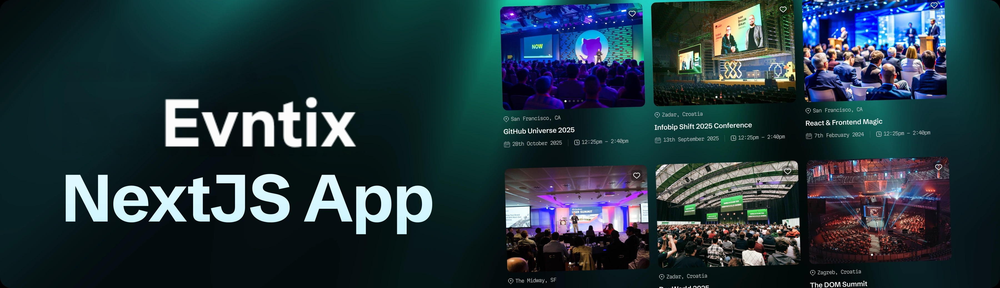
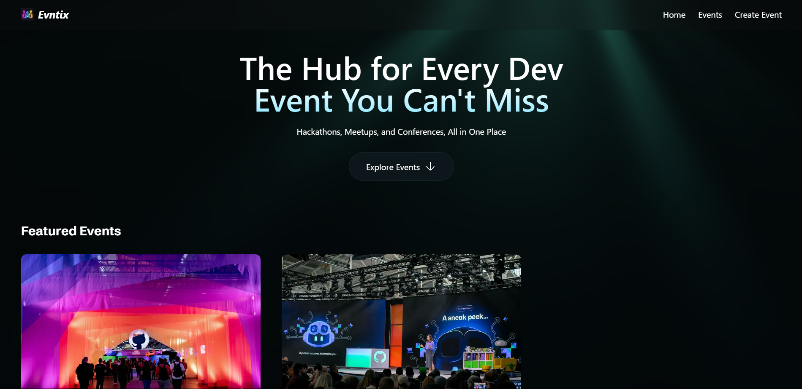
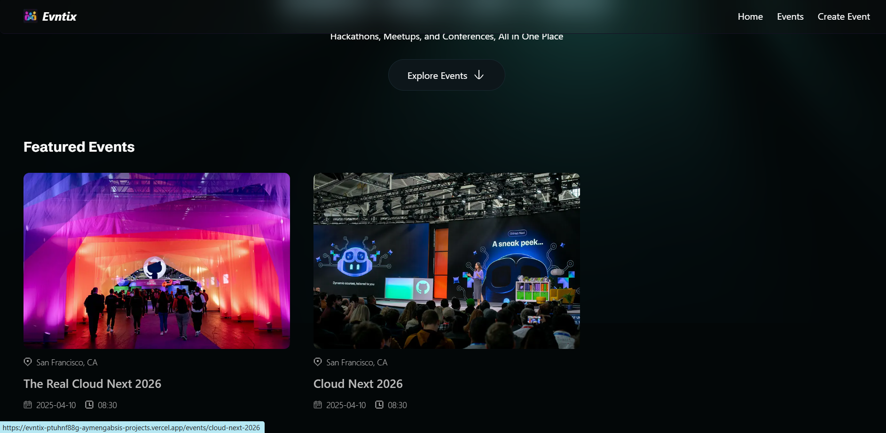
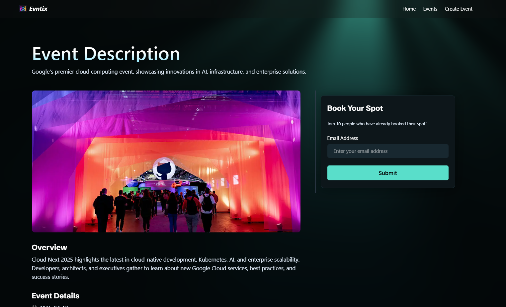
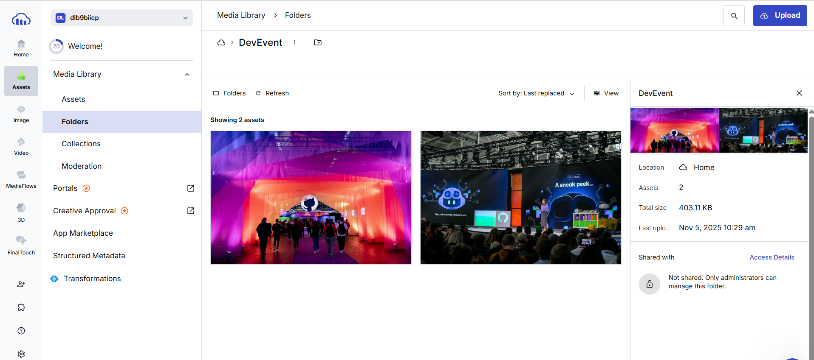
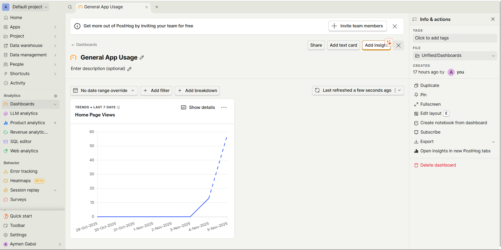
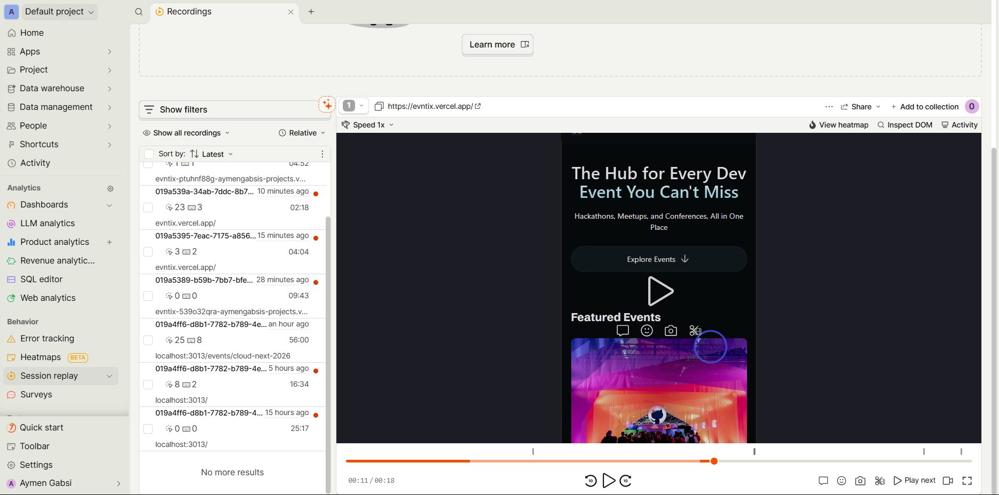
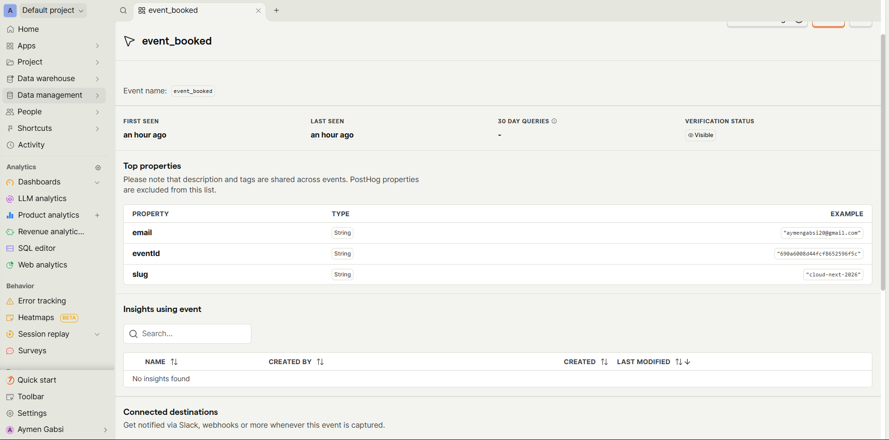

<div align="center">
  <br />
    <a href="" target="_blank">
          
    </a>
  <br />

  <div>
 
 

<br/>

 

 
 
  </div>

  <h3 align="center">Evntix — A Modern Event Management Platform</h3>

</div>

## 📋 <a name="table">Table of Contents</a>

1. ✨ [Introduction](#introduction)
2. ⚙️ [Tech Stack](#tech-stack)
3. 🔋 [Features](#features)
4. 🚀 [Live Demo](#live-demo)
5. 📸 [Screenshots](#screenshots)
6. 🤸 [Quick Start](#quick-start)
7. 🚀 [Deployment](#deployment)

## <a name="introduction">✨ Introduction</a>

**Evntix** is a modern full-stack event management platform designed to **organize, promote, and track events seamlessly**.  
It features a dynamic homepage with upcoming and featured events, secure API endpoints for CRUD operations, image uploads powered by Cloudinary, individual event detail pages, and analytics to monitor engagement.

Whether you’re an event organizer or a curious learner, Evntix demonstrates how to build a production-ready, data-driven web application with clean architecture and performance optimization in mind.

## <a name="tech-stack">⚙️ Tech Stack</a>

- **[Next.js](https://nextjs.org/docs)** — Full-stack React framework for modern web applications with server-side rendering and static site generation.
- **[TypeScript](https://www.typescriptlang.org/)** — Strongly typed JavaScript for better code reliability and scalability.
- **[Tailwind CSS](https://tailwindcss.com/)** — Utility-first CSS framework for rapid UI development.
- **[MongoDB](https://www.mongodb.com/)** — NoSQL document database for fast and flexible data storage.
- **[Mongoose](https://mongoosejs.com/)** — ODM layer to model and manage MongoDB data elegantly.
- **[Cloudinary](https://cloudinary.com/)** — Media management and image optimization in the cloud.
- **[PostHog](https://posthog.com/)** — Open-source analytics for event tracking and user behavior insights.
- **[Warp](https://go.warp.dev/)** — Developer-focused terminal for efficiency and collaboration.
- **[CodeRabbit](https://coderabbit.link/)** — AI-assisted code generation and review tool for developers.

## <a name="features">🔋 Features</a>

✨ **Dynamic Home Page** — View and browse featured and upcoming events with clean, responsive UI.  
⚡ **CRUD Operations** — Full API routes to create, update, delete, and retrieve events.  
☁️ **Cloudinary Integration** — Upload and manage event images effortlessly.  
🎟️ **Event Detail Pages** — Explore detailed event info, register, and view similar events.  
🚀 **Next.js 16 Caching** — Leverages cutting-edge caching for lightning-fast load times.  
📊 **PostHog Analytics** — Monitor performance and user interactions to improve engagement.

And much more — including clean code structure, reusability, and scalability for real-world deployments.

## <a name="live-demo">🚀 Live Demo</a>

**Here is a working live demo : [evntix.vercel.app/](https://evntix.vercel.app/)**

## <a name="screenshots">📸 Screenshots</a>

<p align="center">
  
</p>
<p align="center">
  
</p>
<p align="center">
  
</p>
<p align="center">
  
</p>
<p align="center">
  
</p>
<p align="center">
  
</p>
<p align="center">
  
</p>
<p align="center">
  
</p>
<p align="center">
  
</p>

## <a name="quick-start">🤸 Quick Start</a>

Follow these steps to run **Evntix** locally:

### Prerequisites

Ensure you have installed:

- [Git](https://git-scm.com/)
- [Node.js](https://nodejs.org/)
- [npm](https://www.npmjs.com/)

### 1️⃣ Cloning the Repository

```bash
git clone https://github.com/AymenGabsi/event-platform-nextjs16.git
cd evntix
```

### 2️⃣ Installing Dependencies

```bash
npm install
```

### 3️⃣ Set Up Environment Variables

Create a `.env` file in the project root and include the following:

```env
NEXT_PUBLIC_BASE_URL=http://localhost:3000/

MONGODB_URI=

CLOUDINARY_URL=

NEXT_PUBLIC_POSTHOG_KEY=
NEXT_PUBLIC_POSTHOG_HOST=https://eu.i.posthog.com
```

Replace these placeholders with your actual keys and URLs from your chosen services.

### 4️⃣ Running the Project

```bash
npm run dev
```

Then visit [http://localhost:3000](http://localhost:3000) in your browser 🚀

## <a name="deployment">🚀 Deployment</a>

### Deploy to Vercel

```sh
npm run build
vercel deploy
```

### Configure Environment Variables on Vercel

1. Go to your **Vercel dashboard**.
2. Navigate to your project settings.
3. Under the **Environment Variables** section, add all variables from your `.env.local` file.
4. Deploy your project!

## 👥 Contributing

We welcome contributions! To contribute:

1. **Fork the repo.**
2. **Create a new branch:** `git checkout -b feature-name`.
3. **Make your changes** and commit: `git commit -m 'Added new feature'`.
4. **Push to the branch:** `git push origin feature-name`.
5. **Open a Pull Request** and describe your changes.

### Contribution Guidelines

- Follow the existing coding style.
- Write clear, concise commit messages.
- Ensure new features are properly documented.
- Test changes thoroughly before submitting a PR.

---

## 📝 License

This project is licensed under the **MIT License**.

---

## 📧 Contact

For questions, feedback, or collaborations:

- **Email:** aymengabsi.se@gmail.com
- **GitHub Issues:** [Open an issue](https://github.com/AymenGabsi/mock_interview_platform/issues)
- **Community Chat:** Join our [Discord server](https://discord.gg/your-server-link)
